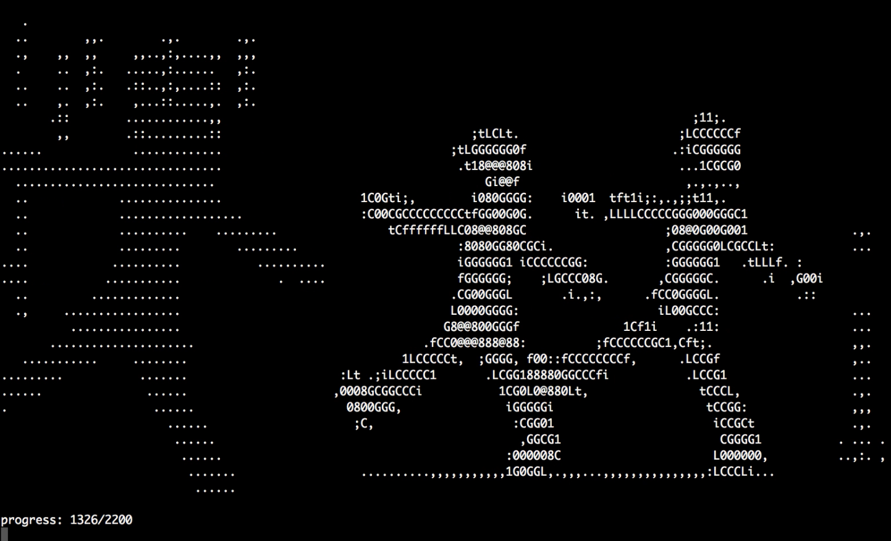

# pixelart

[](https://github.com/micooz/pixelart/blob/master/LICENSE)
[](https://github.com/micooz/pixelart)

Play video as characters in terminal.



## Prerequisites

* Node.js 8.x or above
* ffmpeg 3.x or above

## Extract Video & Audio Frames

Prepare a video that ffmpeg can decode from, then type the following commands in your terminal:

```
$ mkdir frames
$ ./extract.sh video.mp4 0:0:0 1000 ./frames
```

This will convert each frame to text files for later animation.

## Play in Terminal

Play video in 30 fps:

```
$ node play.js ./frames 30
```

## License

MIT